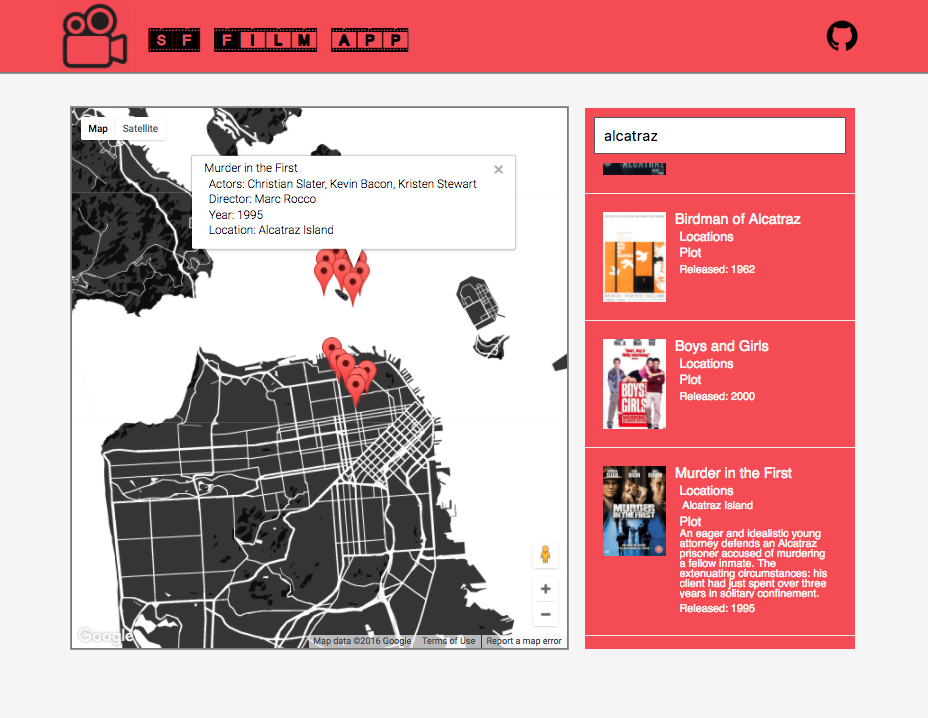

## SF Film App
[Live Link](http://www.brentluna.com/sf_film_app/)

### Description 

This is an app that will allow a user to search for Movies that where made in San Francisco. As the user searches, it will autcomplete results and place markers on the map, that when clicked provide details about the movie. 

### Technologies 

- JavaScript
- React.js 
- Redux.js 
- Google Geocode API 
- SF Data API 
- Google Maps API 
- Overlapping Marker Spiderfy
- Open Movie Database API

The app is built using React.js components, and I implemented a redux cycle for storing the results of the movie Search. When the user searches, it will query the SF Data API to find movies that match, from there, it takes that response and makes a request to the Open Movie Database API to get the plot summary and a Poster for each movie, which then get added to my stores state. From there I update the Markers on the map, by first utilizing the Geocode API to convert the generic Location names that SF Data holds, into Latitude and Longitude coordinates, and creating markers with that Data. I utilized a package called Overlapping Marker Spiderfy, to spread out overlapping markers in a spiderweb fasion.

### Todo 

- Update UI 
- Add click handler on list results to open marker data
- Add marker onHover listeners to display the image

